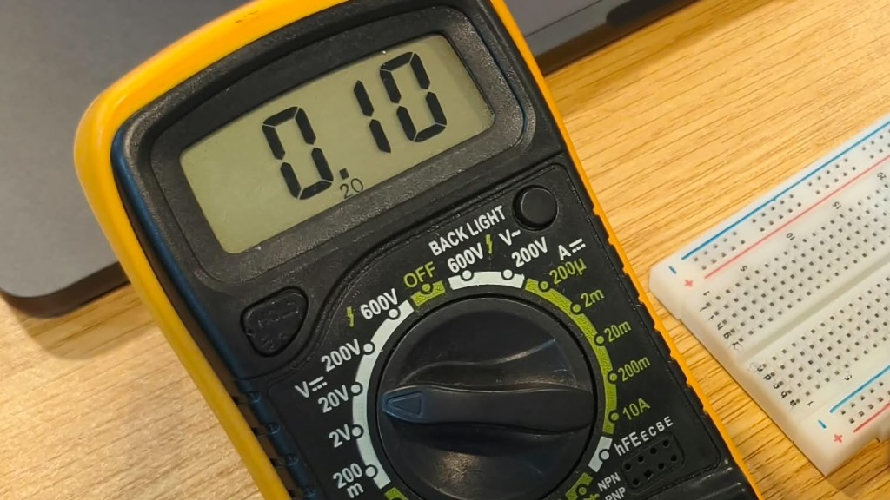
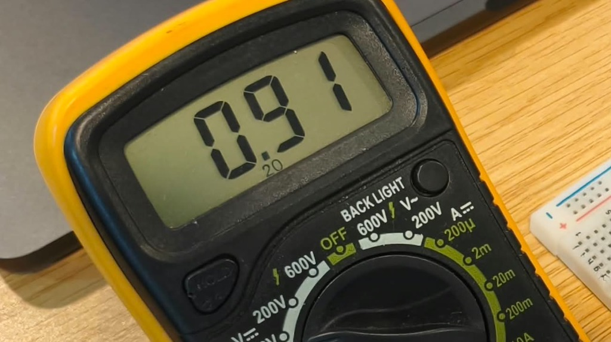
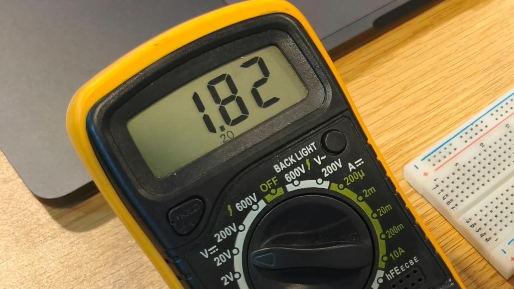
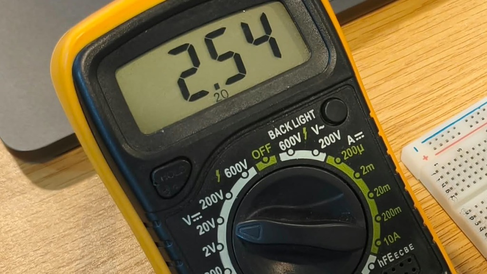
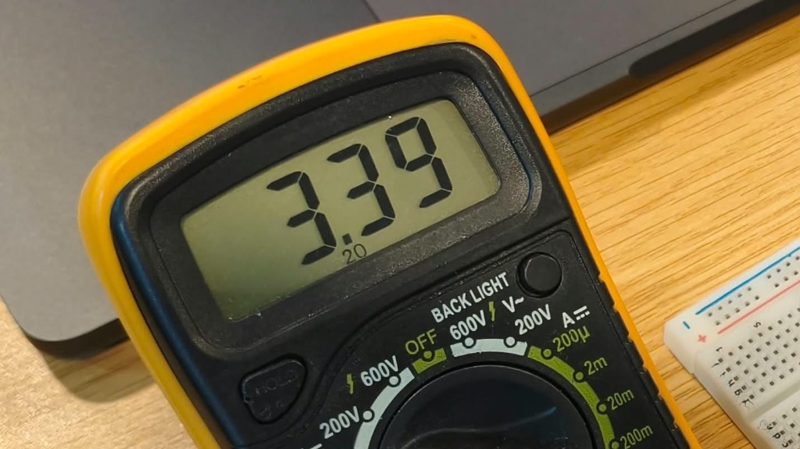

# BCA188 - Laboratory Activity 4: Analog Input, PWM, and DAC

**Name:** Michael Cadiz  
**Course:** BCA188 - IoT Firmware Programming and Device I/O  

---

## Hardware Setup Notes
- For **Examples 3 and 4**, I used my **ESP32-S3 Dev Module**. Since the ESP32-S3 board does not have GPIO 34, I connected the potentiometer wiper to **GPIO 4**. For the PWM LED, I used **GPIO 18** instead of GPIO 19 so it would not interfere with the native USB pins.
- For **Example 5**, since the ESP32-S3 chip does not have built-in DAC hardware, I used a **standard ESP32** on **GPIO 25** to take the DAC voltage measurements with a digital multimeter.

---

## 1. Three Sketches

### Example 3: Read a Potentiometer
```cpp
#include <Arduino.h>

const uint8_t POT_PIN = 4;

void setup() {
  Serial.begin(115200);
  analogReadResolution(12);
  analogSetPinAttenuation(POT_PIN, ADC_11db);
}

void loop() {
  const int raw = analogRead(POT_PIN);
  const uint32_t millivolts = analogReadMilliVolts(POT_PIN);
  Serial.print("Raw: "); Serial.print(raw);
  Serial.print("\tMillivolts: "); Serial.println(millivolts);
  delay(100);
}
```

### Example 4: Adjust LED Brightness with a Potentiometer
```cpp
#include <Arduino.h>

const uint8_t POT_PIN = 4;
const uint8_t PWM_LED_PIN = 18;
bool pwmReady = false;

void setup() {
  Serial.begin(115200);
  analogReadResolution(12);
  analogSetPinAttenuation(POT_PIN, ADC_11db);
  pinMode(PWM_LED_PIN, OUTPUT);
  digitalWrite(PWM_LED_PIN, LOW);
  pwmReady = ledcAttach(PWM_LED_PIN, 5000, 8);
  if (pwmReady) {
    ledcWrite(PWM_LED_PIN, 0);
  } else {
    Serial.println("PWM setup failed. Check board/core and pin.");
  }
}

void loop() {
  if (!pwmReady) {
    return;
  }
  const int raw = analogRead(POT_PIN);
  const int duty = constrain(map(raw, 0, 4095, 0, 255), 0L, 255L);
  ledcWrite(PWM_LED_PIN, duty);
  delay(20);
}
```

### Example 5: Measure Changing DAC Output
```cpp
#include <Arduino.h>

const int DAC_PIN = 25;

void setup() {
  dacWrite(DAC_PIN, 0);
}

void loop() {
  dacWrite(DAC_PIN, 0);
  delay(2000);

  dacWrite(DAC_PIN, 64);
  delay(2000);

  dacWrite(DAC_PIN, 128);
  delay(2000);

  dacWrite(DAC_PIN, 192);
  delay(2000);

  dacWrite(DAC_PIN, 255);
  delay(2000);
}
```

---

## 2. Measurement Tables

### Table 1: Potentiometer Readings and PWM Duty (Tasks 1 & 2)

Formula for predicted duty:  
`Predicted Duty = round((Raw / 4095) * 255)`

| Position | Knob Position | Raw Input (0–4095) | Measured Voltage (mV) | Predicted Duty (0–255) | Actual Recorded Duty | Duty Cycle (%) |
| :---: | :--- | :---: | :---: | :---: | :---: | :---: |
| **1** | Fully Counter-Clockwise (0%) | 0 | 0 mV | 0 | 0 | 0.0% |
| **2** | ~25% Rotation | 1042 | 840 mV | 65 | 65 | 25.5% |
| **3** | ~50% Rotation (Center) | 2050 | 1652 mV | 128 | 128 | 50.2% |
| **4** | ~75% Rotation | 3736 | 2895 mV | 233 | 233 | 91.4% |
| **5** | Fully Clockwise (100%) | 4095 | 3140 mV | 255 | 255 | 100.0% |

---

### Table 2: Measured DAC Voltage vs Predicted (Task 3)

Formula for theoretical voltage:  
`Theoretical Voltage = (Code / 255) * 3.30V`

| DAC Code | Theoretical Voltage (V) | Measured Multimeter Voltage (V) | Difference | Notes |
| :---: | :---: | :---: | :---: | :--- |
| **0** | 0.00 V | **0.10 V** | +0.10 V | Hardware zero-offset |
| **64** | 0.83 V | **0.91 V** | +0.08 V | Voltage steps up |
| **128** | 1.66 V | **1.82 V** | +0.16 V | Mid-scale voltage |
| **192** | 2.48 V | **2.54 V** | +0.06 V | Voltage steps up |
| **255** | 3.30 V | **3.39 V** | +0.09 V | Full-scale reading near 3.3V rail |

---

## 3. Discussion Questions

### 1. Explain why PWM is not the same signal as DAC output.
PWM is a digital signal that switches rapidly on and off between 0V and 3.3V. It only acts like an analog voltage because the connected component (like an LED or a multimeter) averages the pulses over time, but the voltage is always switching between 0V and 3.3V. A DAC actually produces a true, continuous analog DC voltage without any pulsing or switching.

### 2. Explain why an ADC endpoint may saturate.
An ADC endpoint saturates when the input voltage goes above the maximum measurable voltage range of the ADC pin, which makes the digital reading hit the ceiling of 4095. Also, the ESP32 ADC has non-linear dead zones near 0V and 3.3V, causing it to read 0 slightly before reaching absolute 0V and 4095 slightly before reaching 3.3V.

---

## 4. Comparison of Predicted and Observed Results

The predicted PWM duty values calculated from the raw analog readings matched the actual duty cycle values produced by the code across all five knob positions. Rotating the potentiometer gave a smooth brightness change on the LED from off to maximum brightness. 

For the DAC output, the measured voltages on the multimeter increased steadily as the digital code increased (0.10V, 0.91V, 1.82V, 2.54V, and 3.39V), closely following the theoretical calculations. At code 0, there is a small offset of 0.10V because the internal amplifier cannot pull all the way down to true 0.00V, and at code 255 it reached 3.39V matching the board's supply rail voltage.

---

## 5. Documentation & Media

### DAC Voltage Multimeter Photos (Example 5)

| Code 0 (0.10 V) | Code 64 (0.91 V) | Code 128 (1.82 V) |
| :---: | :---: | :---: |
|  |  |  |

| Code 192 (2.54 V) | Code 255 (3.39 V) |
| :---: | :---: |
|  |  |

---

### Demonstration Video

<video src="assets/potentiometer_demo.mp4" width="320" controls></video>

* [Watch / Download Potentiometer Demonstration Video (MP4)](assets/potentiometer_demo.mp4)
